# ComparEdge MCP Server

<div align="center">



</div>

[](https://www.npmjs.com/package/@comparedge/mcp-server)
[](https://smithery.ai/servers/imkemit/comparedge)
[](https://opensource.org/licenses/MIT)


Your assistant already knows what Notion is. It does not know that Notion Plus costs $12 a seat this month, or that the tool you are evaluating quietly dropped its free plan in spring. Training data ages; prices move. This server closes that gap with verified pricing, plans, ratings and alternatives for 494 SaaS and AI tools, checked against vendor pages before they ship. Live docs and examples: [comparedge.com/mcp](https://comparedge.com/mcp).

Zero dependencies, no API key, no account. Works in Claude Desktop, Cursor, VS Code and any other MCP client.

## Install

Add one block to your client config:

```json
{
  "mcpServers": {
    "comparedge": {
      "command": "npx",
      "args": ["-y", "@comparedge/mcp-server@latest"]
    }
  }
}
```

Claude Desktop keeps this file at `~/Library/Application Support/Claude/claude_desktop_config.json`. Cursor: Settings, then MCP, then Add Server. VS Code with Copilot reads `.vscode/mcp.json`. Per-client walkthroughs live in the [setup guide](https://comparedge.com/mcp/docs).

## What you can ask

Once connected, questions like these stop producing guesses and start producing verified numbers:

- How much does Slack cost for a team of 40 on annual billing?
- Find me a CRM under $20 per user that still has a real free plan.
- I want to leave Salesforce. What do people switch to, and what does the move cost?
- Which AI coding assistants are top rated right now?
- Compare Notion and Coda plan by plan.

## Tools

Eight tools, each a read-only lookup against the catalog.

| Tool | Returns | Params |
|---|---|---|
| `search_tools` | products matching a name, keyword or use case | `query`, `limit?` |
| `get_tool` | full profile for one product | `slug` |
| `get_pricing` | every plan with price, period and features, plus trial and free-plan status | `slug` |
| `compare_tools` | two products side by side: pricing, features, ratings | `tool1`, `tool2` |
| `get_alternatives` | top alternatives in the same category, ranked by rating | `slug`, `limit?` |
| `list_category` | all tools in one category with a pricing overview | `category`, `sort_by?`, `free_only?` |
| `get_leaderboard` | top-rated tools, one category or overall | `category?`, `limit?` |
| `list_categories` | all 44 category slugs with display names | none |

Products are addressed by slug: `notion`, `github-copilot`, `screaming-frog`. When in doubt, `search_tools` first. Category slugs double as public pages a human can open, for example the [LLM category hub](https://comparedge.com/best/llm). LLM entries carry per-token API pricing on top of the plan data.

## Prompts

Four workflows ship as prompts your client can expose as slash commands:

| Prompt | Args | What it runs |
|---|---|---|
| `find_best_tool` | `use_case` | searches the catalog, prices the top matches, returns a ranked pick |
| `compare_pricing` | `tool_a`, `tool_b` | plan-by-plan price comparison |
| `evaluate_tool` | `tool` | profile, verified pricing and top alternatives in one pass |
| `category_overview` | `category` | category leaderboard with pricing for the leaders |

## Supported categories

`accounting` `ai-agents` `ai-assistants` `ai-coding` `ai-image` `ai-meeting` `ai-productivity` `ai-security` `ai-video` `ai-voice` `ai-writing` `analytics` `cloud-hosting` `cloud-security` `compliance` `crm` `crypto-analytics` `crypto-exchanges` `crypto-portfolio-trackers` `crypto-tax` `crypto-telegram-bots` `crypto-trading-bots` `crypto-wallets` `customer-support` `data-observability` `databases` `defi-tools` `design-tools` `dex` `email-marketing` `endpoint-security` `erp` `finops` `hr-tools` `iam` `llm` `password-managers` `payments` `project-management` `seo-tools` `vector-databases` `video-conferencing` `vpn` `website-builders`

## Where the data comes from

The catalog is maintained by [ComparEdge](https://comparedge.com). Every price traces to the vendor's own pricing page, harvested from the live DOM and re-verified on a rolling schedule; each record carries its verification date. The pipeline is documented in the [methodology](https://comparedge.com/methodology), and the full catalog ships as an [open dataset](https://comparedge.com/open-data) under CC BY 4.0. If a tool is not a fit, the [alternatives hub](https://comparedge.com/alternatives) covers switch paths for the whole catalog.

## License

MIT. Built on the [Model Context Protocol](https://modelcontextprotocol.io).
